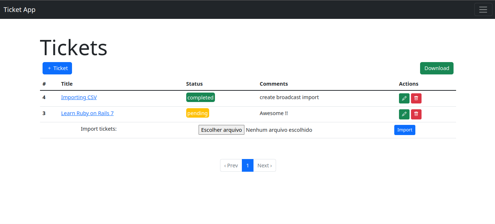

# Ticket App



## Config

* Rails: 7.0.3
* Devise: 4.8.2
* Rspec
* ShouldaMatchers
* FactoryBotRails
* Bootstrap: 5.1
* Postgres: 14.4

## Setup

* Install dependencies

```ssh
bundle install
```

```ssh
yarn install
```

* Create, migrate and seed database:

```ssh
rails db:create db:migrate db:seed
```

* Run project

```ssh
bin/dev
```
